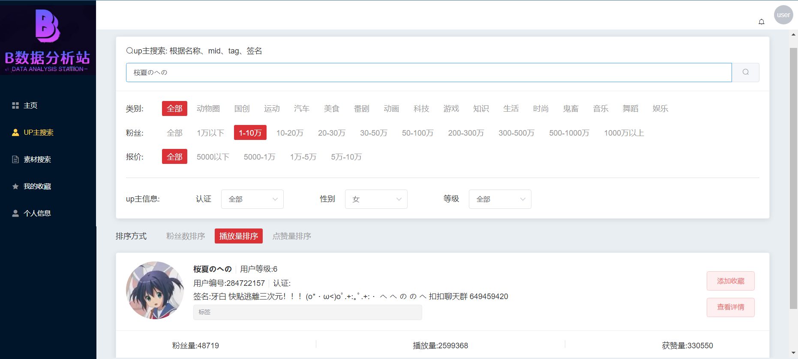
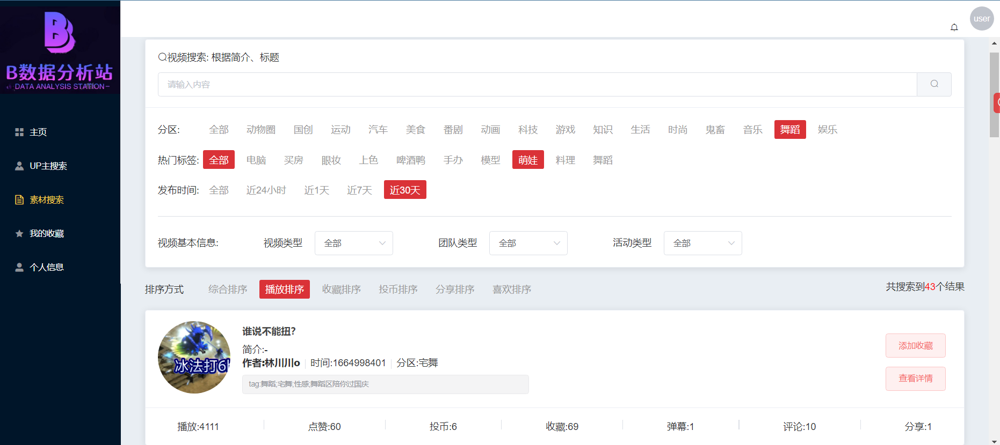
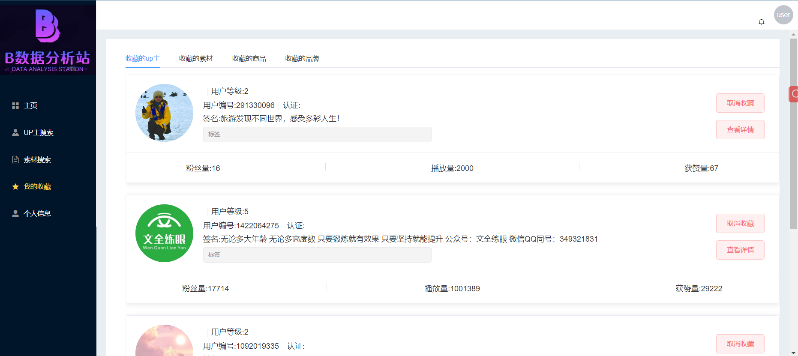
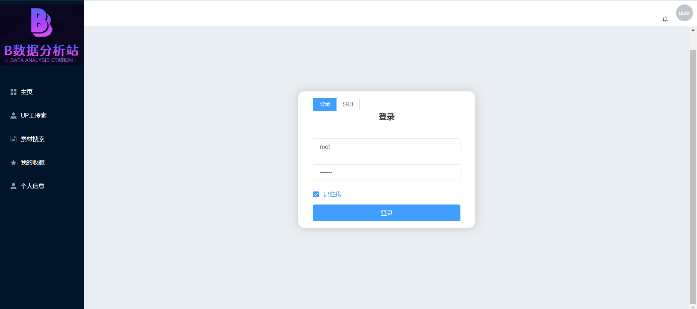
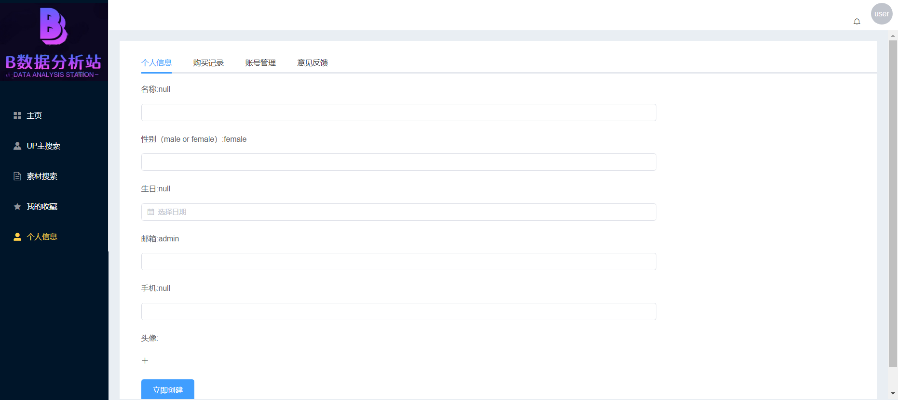
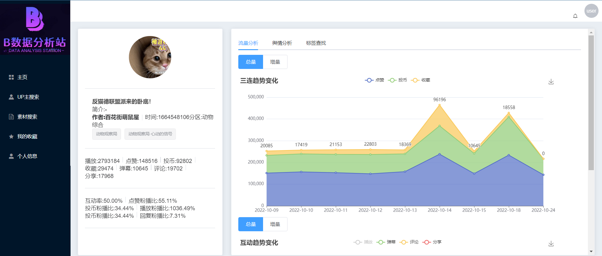

# 项目：

### 项目简介

量化B站数据信息，分析up主的数据表现，挖掘商业价值，为用户匹配优质up主

### 项目源码

### 项目启动说明

1. 后端启动
   * 拉取代码
      * [drf_bili](https://github.com/yuchen59384/drf_bili) ，在页面中直接Download ZIP
      * 或使用如下Git命令clone代码
          ```shell script
          git clone https://github.com/yuchen59384/drf_bili.git
          ```
   * cd主目录，安装Python第三方包
      * ```shell script
            pip install -r requirements.txt
            ```
   * 配置Django配置文件
      * 默认使用SQLite，如使用MySQL，请更改settings/dev.py下的DATABASES参数
      * redis配置，配置settings/dev.py下REDIS_HOST、REDIS_PORT、REDIS_PWD等参数
    * 数据库迁移
        * ```shell script
            python manage.py migrate
            ```
    * 初始化数据库基础数据
        * ```shell script
            python manage.py loaddata init.json
            ```
    * 启动Django项目
        * ```shell script
            python manage.py runserver 0.0.0.0:5000
            ```
    * 接口文档
        * http://127.0.0.1:5000/docs/

2. 前端启动

    - 待完善

### 代码结构

#### 后端部分

```python
"""             
+--.sqlenv
+--apps 
| +--kol --up主搜索页面/详情页面
| | +--admin.py --后台管理
| | +--apps.py
| | +--filters.py --过滤组件
| | +--migrations --数据库
| | +--models.py --模型
| | +--ser.py --序列化器
| | +--tests.py 
| | +--urls.py --应用路由
| | +--views.py --类视图
| +--note --视频搜索/详情页面
| +--operation --用户收藏
| +--users --up主搜索页面/详情页面

+--bilibili                   
| +--asgi.py
| +--celery.py --celery初始化
| +--media --静态资源
| +--settings
| | +--base.py --django基础配置
| | +--celeryConf.py --celery配置
| | +--dev.py
| | +--drfConf.py --drf扩展配置
| | +--log.py --日志配置
| | +--prod.py
| +--urls.py --总路由
| +--wsgi.py

+--crawl --爬虫					
| +--items.py --scrapy djangoItem类
| +--log --日志
| | +--2022107.log
| +--middlewares.py --爬虫/下载中间件
| +--pipelines.py --管道:数据处理/更新/持久化存储
| +--process.py --数据存储、更新策略
| +--settings.py --scrapy配置
| +--spiders --爬虫parse
| | +--get_danmu_comment.py --弹幕评论
| | +--get_kol.py --up主的最新信息
| | +--get_mid.py --获取up主
| | +--get_note.py --up主的最近视频

+--Dockerfile --docker配置
+--logs --django日志
| +--admin_error.log
| +--admin_info.log
| +--admin_operation.log
| +--admin_query.log
+--manage.py
+--requirements.txt --环境
+--scrapy.cfg --启动配置
+--start.py
+--start.sh --docker依赖脚本
+--static --静态资源
+--templates
+--utils --公共基类
| +--exception.py
| +--model.py
| +--rendererresponse.py
+--uwsgi.ini
"""
```

#### 前端部分

待完善

### 功能模块

1. UP主搜索

    - 层级筛选（类别、粉丝数、认证、性别、等级、报价：~~待实现~~）
    - 多条件排序（粉丝数、播放量、点赞）
    - 分页
    - 聚合搜索（名称、tag、签名、mid）

2. 素材搜索

    - 层级筛选（分区、热门标签、发布时间、视频类型、团队类型、活动类型：~~待实现~~）
    - 多条件排序（综合：~~待实现~~、播放、收藏、投币、分享、喜欢）
    - 分页
    - 聚合搜索（简介、标题）

3. 视频分析

    - 数据概览
    - 人气表现：互动率、互动粉丝比、三连粉丝比
    - 流量分析
        + 互动增量/总量变化
        + 三连增量/总量变化
    - 评论分析：词云、热词
    - 弹幕分析
    - 传播效果：~~待实现~~
    - 相似视频：~~待实现~~

4. UP主分析

    - 数据概览

    - 核心一览

        - 近几天视频数据平均数、粉播比
        - 近十个作品的数据
        - 作品列表

    - 流量分析

        + 粉丝、点赞增量/总量变化
        + 三连、互动增量/总量变化：~~待实现~~

    - 舆情分析

        - 评论分析

        - 弹幕分析

    - 粉丝分析：~~待实现~~
    - 直播数据：~~待实现~~

5. 我的收藏：收藏的up主、视频、品牌：~~待实现~~、商品：~~待实现~~

6. 注册登录

    - 邮箱注册
    - 手机注册：~~待实现~~

7. 个人信息

8. 其它：权限、流量控制，jwt认证

### 功能预览（按应用划分）








